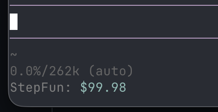

# Pi coding agent StepFun Balance Extension

A [Pi coding agent](https://pi.dev/) extension that monitors your [StepFun](https://platform.stepfun.ai/) API account balance and automatically displays it in the footer when using a StepFun provider.



## Features

- **Auto Footer Display**: Shows available account balance when using StepFun models
- **Smart Caching**: Caches balance data for 30 seconds to avoid excessive API calls

## Install

```bash
pi install npm:@alexanderfortin/pi-stepfun-usage
```

or

```
pi install git:github.com/shaftoe/pi-stepfun-usage
```

or test from source:

```bash
git clone https://github.com/shaftoe/pi-stepfun-usage
cd pi-stepfun-usage

bun install
bun run build
pi -e .
```

## Usage

### Automatic Footer Display

When using a StepFun model (e.g., `step-3.7-flash`, `step-3.5-flash`), the extension automatically displays your available account balance in the footer:

```
StepFun: $12.50
```

The footer updates after each AI turn and on model selection changes. When you switch away from a StepFun model, the footer is cleared.

## Configuration

No configuration needed. The extension automatically:

- Uses cached data for 30 seconds to avoid excessive API calls
- Shows/updates status only when StepFun models are active
- Clears status when switching to non-StepFun models

Make sure your StepFun API key is configured (e.g., via `STEP_API_KEY` environment variable or Pi's provider settings).

## API

The extension uses the StepFun account endpoint: `GET https://api.stepfun.ai/v1/accounts/get`

## Development

```bash
# Run tests
bun run test

# Type check + lint
bun run check

# Auto-fix lint issues
bun run lint:fix

# Watch mode
bun run dev
```

## License

MIT
